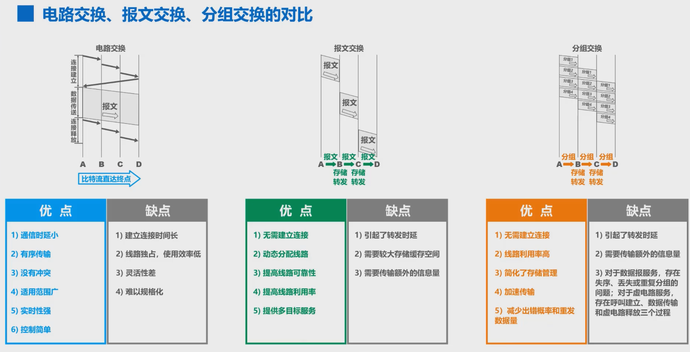
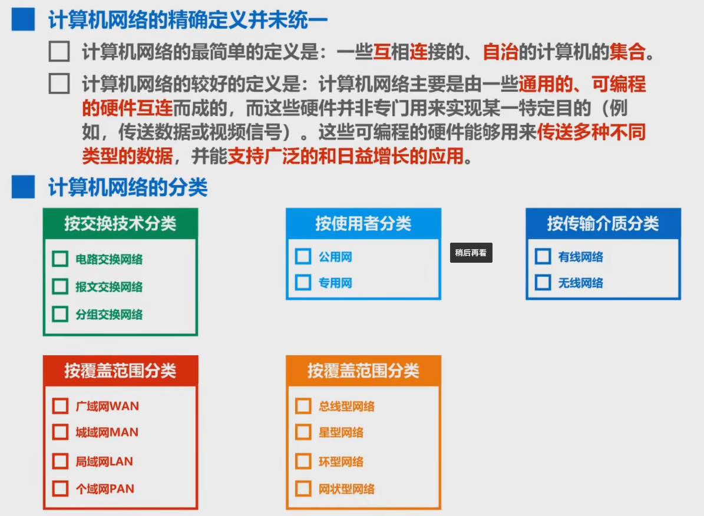
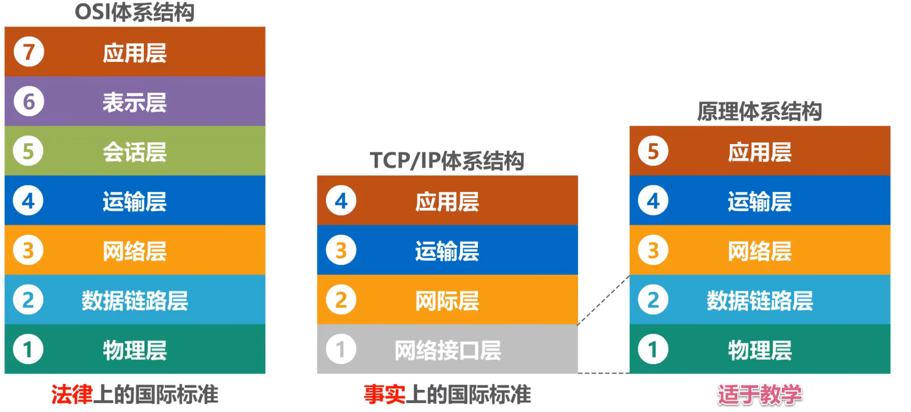
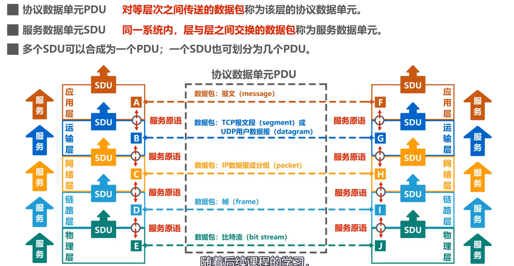
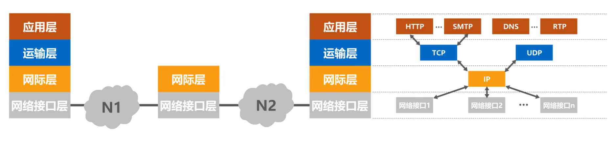

# 概述

### 1. 常见概念

**计算机网络**：由若干节点和链接这些节点的链路组成。
**互连网（internet）**：由多个计算机网络互连而成的网络，网络通过路由器连接在一起，与网络相连的计算机称为主机。
**互联网（Internet）**：专有名词，指当前全球最大的，开放的，由众多网络相互连接而成的指定互连网。
**三级结构**：主干网，地区网，校园网
**ISP**：互联网服务提供者
**IXP**：互联网交换点，允许两个ISP直接相连并且交换分组。
**互联网的组成**：边缘部分（用户直接使用，边缘部分的主机称为端系统），核心部分（大量网络和路由器组成）

### 2. 三种交换方式

==电路交换==：通过“建立连接，通话，释放连接”三个步骤组成，在通话全部时间内，通话的两个用户始终占用端到端的通信资源。

==报文交换==：整个报文先传到相邻节点，整个存储下来后查找转发表转发到下一个节点。

==分组交换==：单个分组先传到相邻节点，整个存储下来后查找转发表转发到下一个节点。

### 计算机网络的定义和分类

### 3. 计算机网络的性能指标

##### 3.1 速率
速率指的是数据的传送速率，往往指的是额定速率，单位是$bit/s$ 。==注意在速率中进制为$1e3$，而在数据量中，进制为$2*pow(2,10)$。==(例如：15GB数据块大小为$15*2*pow(2,10)*8 bit$,但是10Gbit/s表示速率为$10*2*pow(10,9)bit/s$)

##### 3.2 带宽
带宽表示单位时间内网络中某信道所能通过的“最高数据率”，单位是$bit/s$。

##### 3.3 吞吐量
吞吐量表示单位时间内网络中某信道通过的实际数据量，单位是$bit/s$，吞吐量收到网络带宽和网络额定速率的限制。

##### 3.4 时延
时延是指数据（报文，分组等）从网络（或链路）的一端传送到另一端所需的时间。==总时延=发送时延+传播时延+处理时延+排队时延==
1. ==发送时延==：主机或路由器发送数据帧所需要的时间。发送时延=数据帧长度（bit）/发送速率（bit/s）
2. ==传播时延==：电磁波在信道中传播一定距离需要耗费的时间。传播时延=信道长度（m）/传播速率（m/s） （注意：在自由空间的传播速率为$3.0*10^5 km/s$，在铜线的传播速率为$2.3*10^5 km/s$，在光纤的传播速率为$2.0*10^5 km/s$。）
3. ==处理时延==：主机或者路由器收到分组时需要花费一定的时间进行处理。
4. ==排队时延==：排队时延往往取决于网络当时的通信量，当网络的通信量很大时会发生队列溢出，使分组丢失。

注意：有n个分组，m个链路，总时延为：n个分组的发送时延+1个分组的发送时延*（m-1)+一段链路的传播时延*m

##### 3.5 时延带宽积
时延带宽积=传播时延*带宽，单位为bit。

##### 3.6 往返时间RTT
有效数据率=数据长度/(发送时间+RTT)

##### 3.7 利用率
信道的利用率或网络的利用率过高就会产生非常大的时延。

### 4. 计算机的体系结构
计算机网络的体系结构就是这个计算机网络及其构件所应完成的功能的精确定义。

##### 4.1 数据单元的传输

##### 4.2 三种常见体系结构：

