# 运输层

### 1. 概述

>前面的体系结构层次实现了主机到主机的通信，但是实际上通信两端的进程需要靠传输层提供的服务，运输层协议又称为端协议，运输层向高层用户屏蔽了下层的细节，。因特网的运输层为应用层提供了两种不同的运输协议，即面向连接的TCP和无连接的UDP。

##### 1.1 端口号，发送方复用和接收方分用

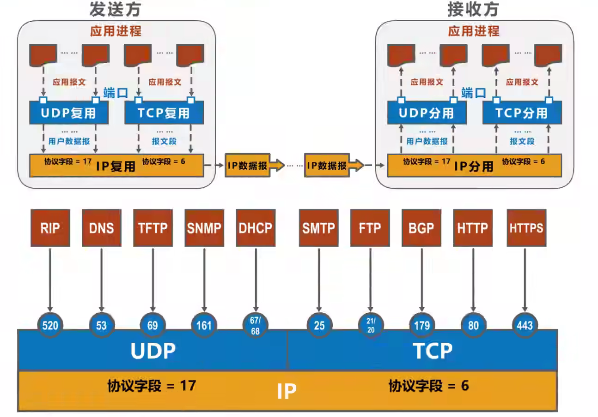

##### 1.2 UDP（用户数据报协议）和TCP（传输控制协议）对比

==UDP可以直接进行数据传输，而TCP在“三次握手”后才能传输数据，再经过“四次挥手”结束连接。==

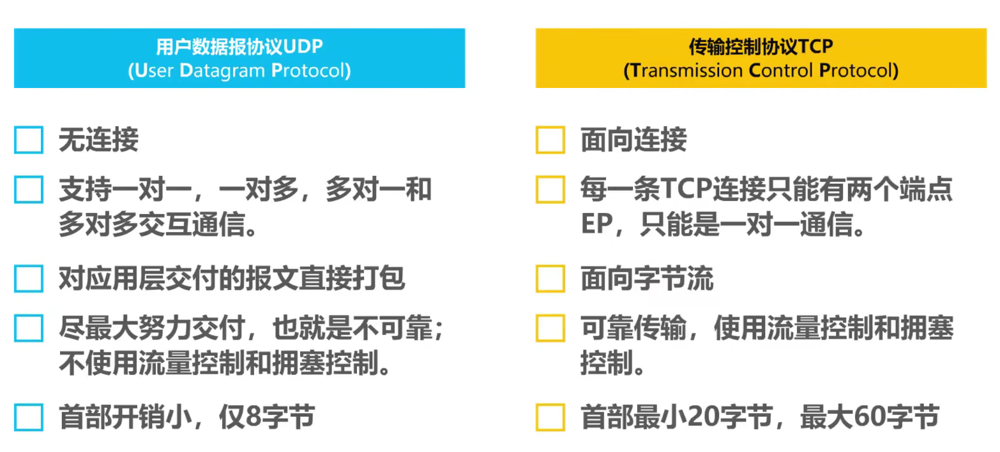

### 2. TCP

##### 2.1 TCP流量控制

所谓流量控制就是让发送方的发送速率不要太快，要让接收方来得及接收，利用==滑动窗口机制==可以很方便地在TCP连接上实现流量控制：
1. TCP接收方利用自己的**接收窗口**的大小来限制发送方**发送窗口**的大小。
2. TCP发送方收到接收方的零窗口通知后，应该启动**持续计数器**，持续计时器超时后，向接收方发送**零窗口探测报文**。

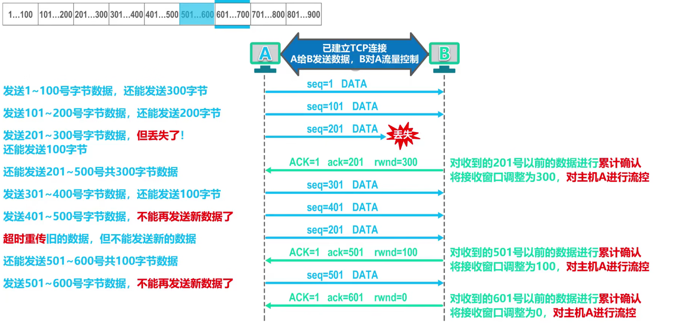
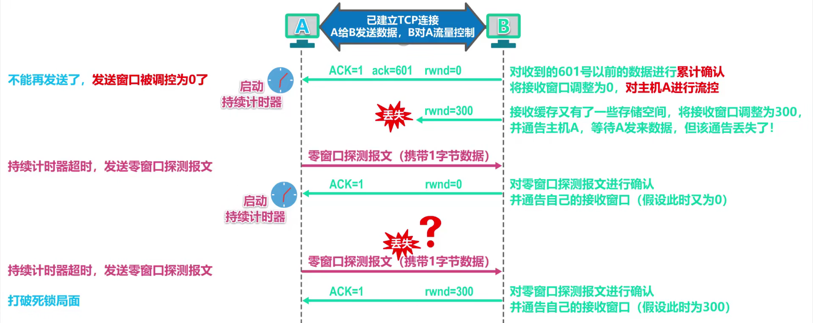

##### 2.2 TCP拥塞控制

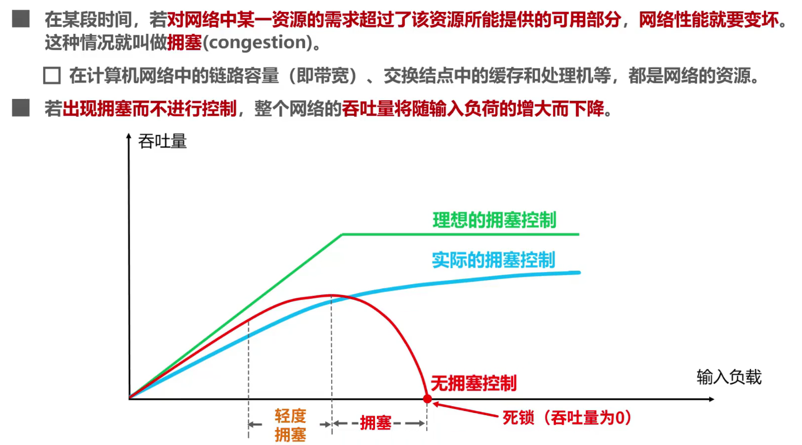

==慢开始，拥塞避免==

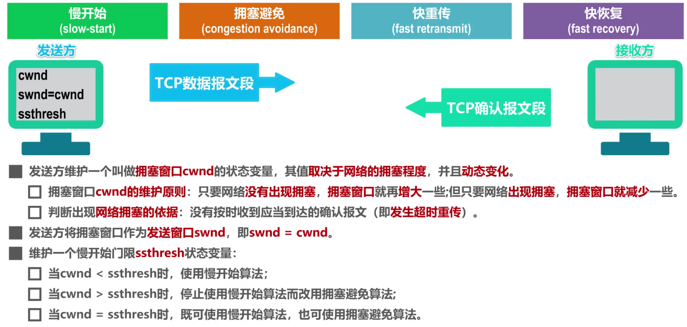
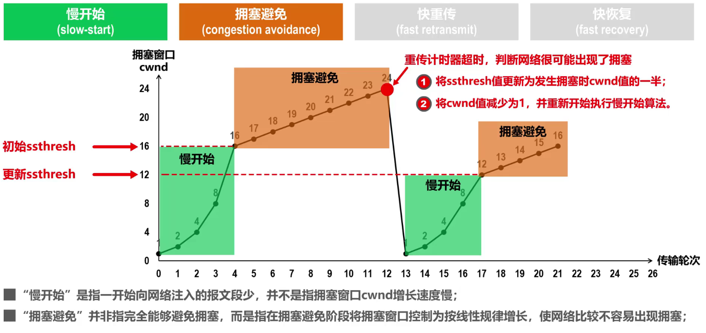

==快重传，快恢复==

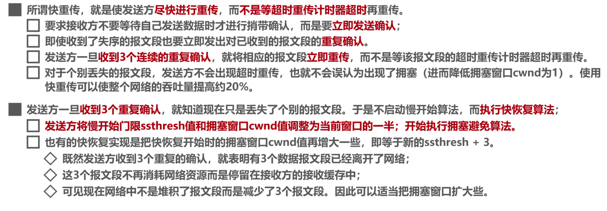

==四种控制算法举例==

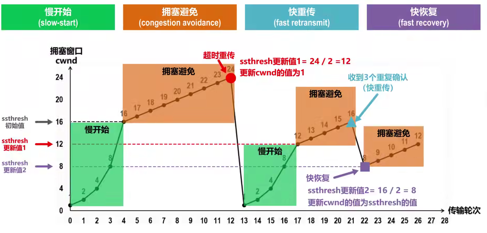

##### 2.3 TCP超时重传时间RTO

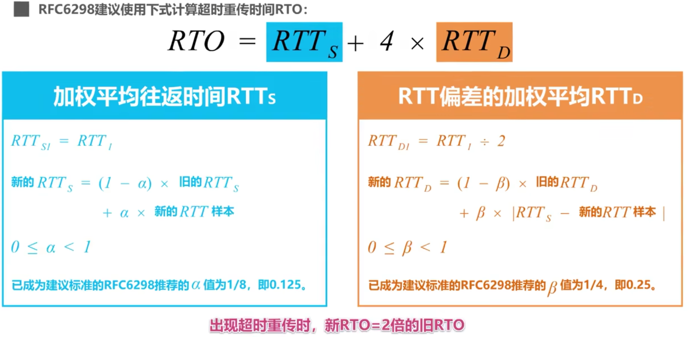

##### 2.4 TCP可靠传输

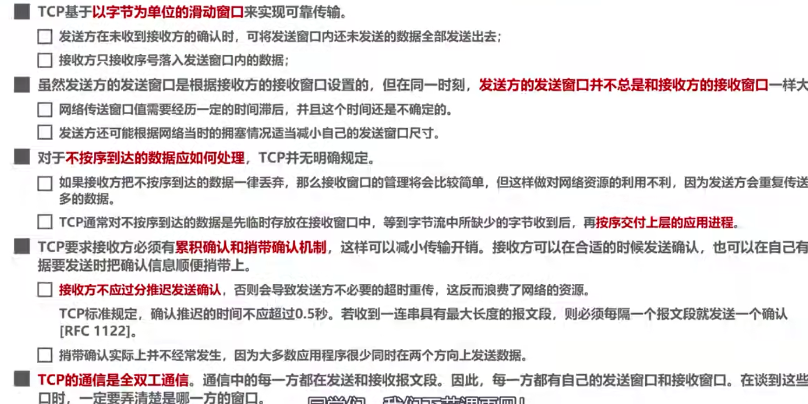

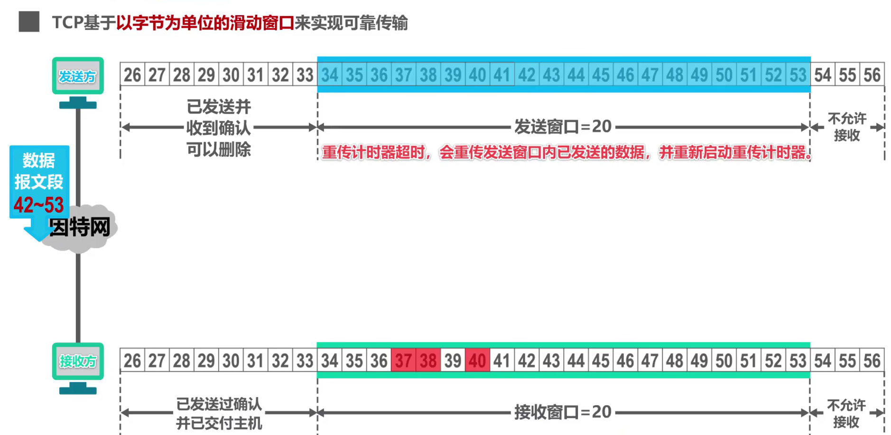

##### 2.5 TCP的运输连接管理

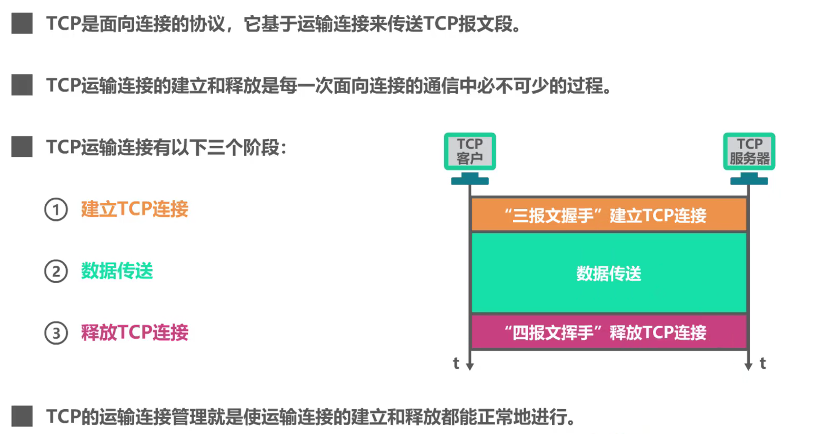

**TCP的连接建立-三次握手协议**

==发送针对TCP连接请求的确认的确认是为了防止失效的连接请求报文段突然又传到了TCP服务器进而导致错误==

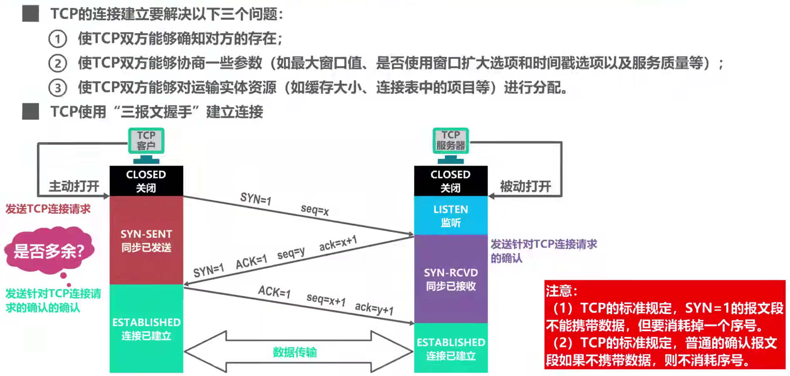

**TCP的连接释放――四次握手协议**

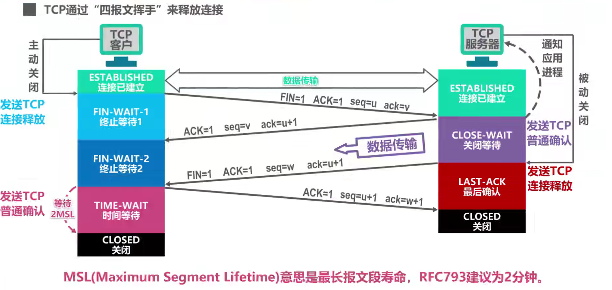
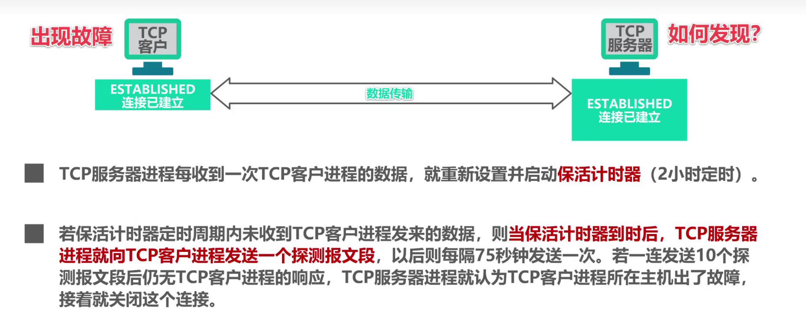

##### 2.6 TCP报文段首部格式

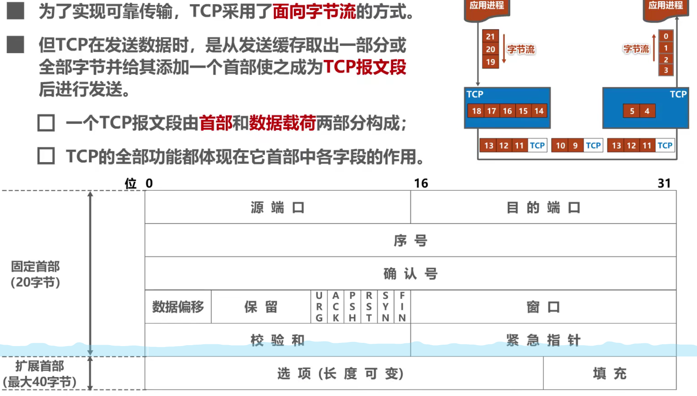