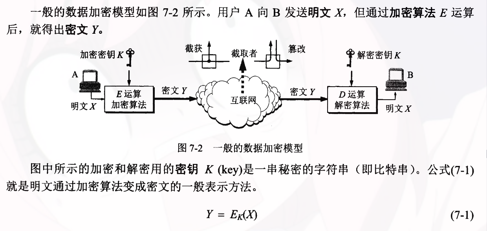

# 网络安全

### 1. 概述

##### 1.1 网络安全性威胁：

>被动攻击：指攻击者从网络上窃听他人的通信内容，通常这类攻击称为截获。
>
>主动攻击：篡改，恶意程序（计算机病毒，计算机蠕虫，特洛伊木马，逻辑炸弹，后门入侵，流氓软件），拒绝服务DOS...

##### 1.2 计算机网络安全性：

一般需要达到四个目标：
1. 保密性：只有信息的发送方和接收方才能懂得所发送的信息的内容。

2. 端点鉴别：能够鉴别信息的发送方和接收方的真实身份。

3. 信息的完整性：信息的内容没有被人篡改过。

4. 运行的安全性：通过访问控制对访问网络的权限加以控制。

##### 1.3 数据加密模型

==密码学分为密码编码学和密码分析学==

- 密码编码学：密码体制的设置学
- 密码分析学：在未知秘钥的情况下从密文推演出明文或秘钥的技术。